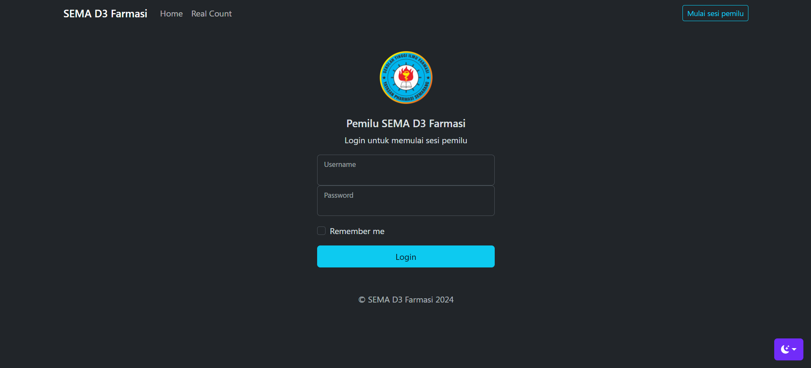
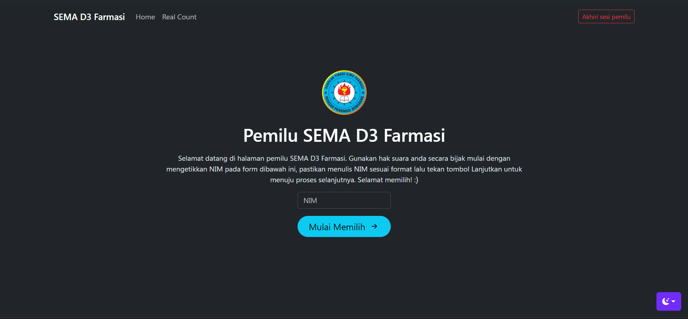
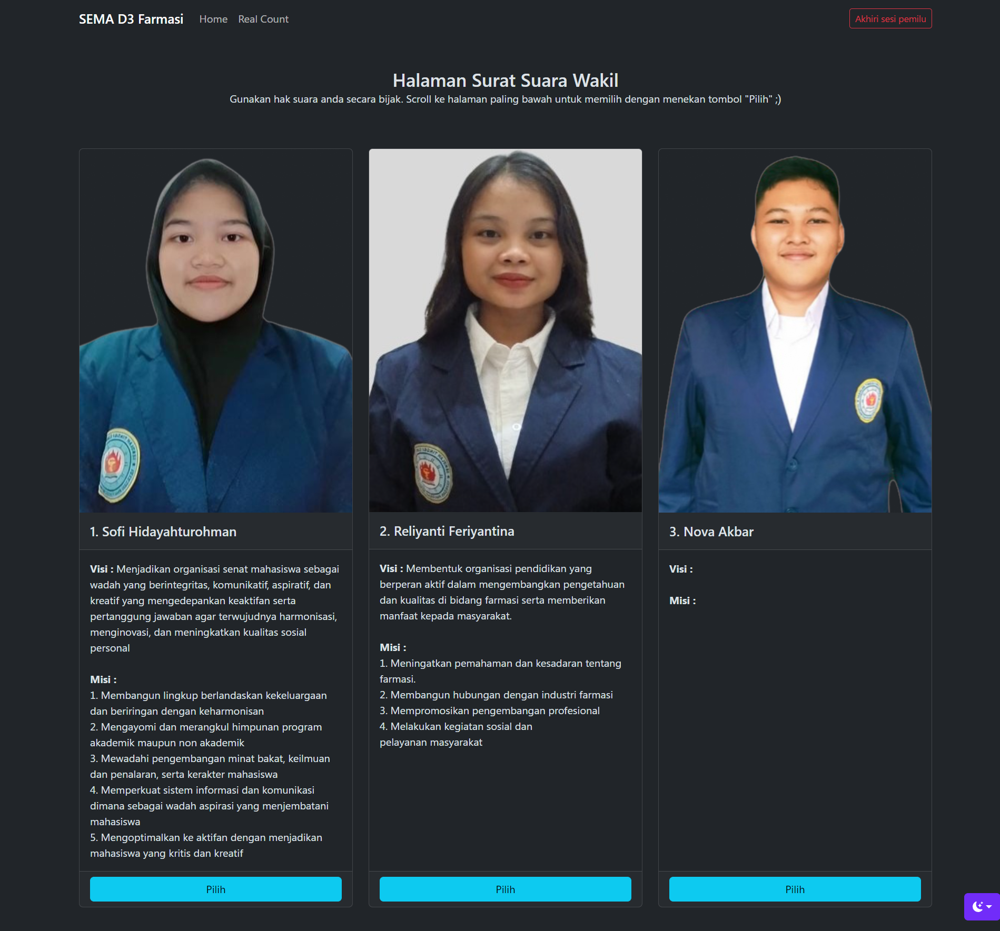
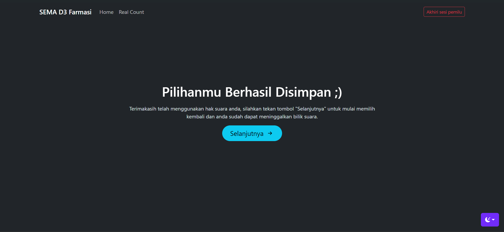
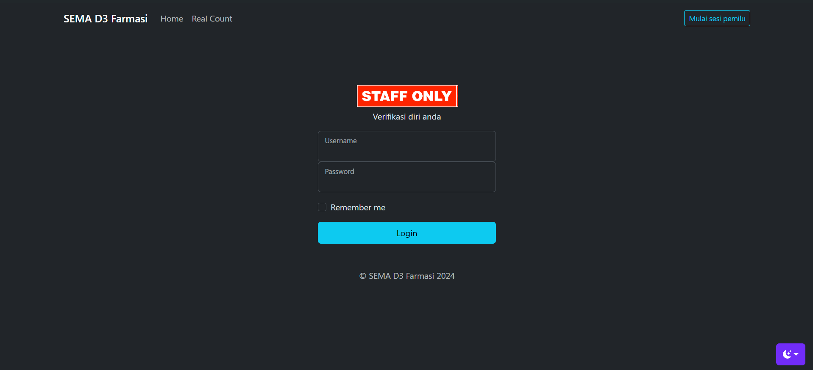
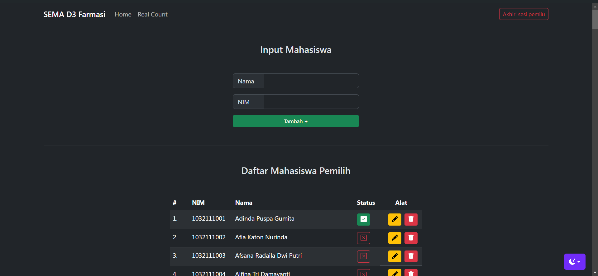

<h1 align="center">Selamat datang di repository Pemilu Stifar 2024! 👋🏻</h1>

<h4 align="center">Website yang digunakan sebagai sarana pemilihan ketua organisasi yang dilengkapi dengan fitur kelola peserta pemilu, yang dibuat dengan <a href="https://www.codeigniter.com/" target="_blank">CodeIgniter</a>.
</h4>

  <a href="#tentang">Deskripsi</a> •
  <a href="#fitur">Alur</a> •

<h2 id="tentang">✅ Deskripsi Website Pemilu</h2>

Website ini digunakan sebagai sarana pemilihan umum ketua organisasi SEMA di Sekolah Tinggi Pharmasi Semarang Program Studi D3 Pharmasi. Dibuat menggunakan Framework Codeigniter 3.0 dan Bootstrap 5.3. Acara ini berlangsung dibulan Maret 2024 dan website berhasil berjalan dan website berhasil menjaga keamanan dan kerahasiaan setelah acara dilaksanakan.

Dibuat dengan mempertimbangkan acuan dari panitia acara tersebut yang ingin menyelenggarakan pemilu dengan sistem bilik, namum tidak menggunakan kertas seperti pemilu pada umumnya. Dengan tetap mempertimbangkan unsur keamanan dan kebutuhan fungsional secara keseluruhan.

<h2 id="fitur">✨ Alur Website</h2>
<h3 id="fitur">👤 Bagian Peserta</h3>

1. Login untuk memulai sesi pemilu dengan (username = orangbejo, password = minumtolakangin). Hanya panitia yang dapat memulai sesi pemilu.

2. Input NIM untuk mulai memilih. Di tahap ini device yang digunakan akan diletakkan pada bilik dan para pemilih akan melakukan pemilihan. NIM merupakan 9 digit kombinasi angka.

3. Halaman surat suara ketua akan tampil. 

4. Halaman surat suara wakil akan tampil. 

5. Suara berhasil disimpan dan peserta dapat meninggalkan bilik suara. 

<h3 id="fitur">🔑 Bagian Admin</h3>

1. Login diakses melalui http://localhost/pemilustifar2024/admin/dashboard dengan (username = orangbejo, password = minumtolakangin)

2. Disini panitia dapat mengelola data pemilih. Mulai dari menambah peserta, mengedit nama peserta, menghapus peserta, serta menghapus suara peserta. Hanya itu.

**
Made with ❤️ by FARISKI NURROHMAN
**
